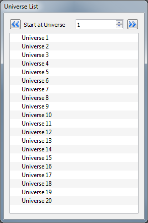
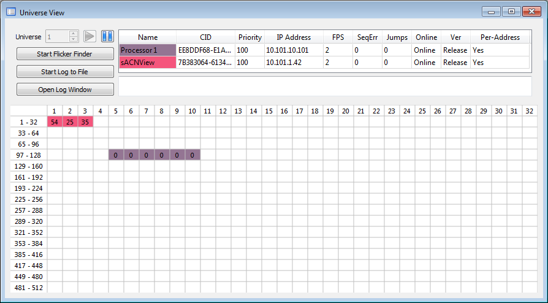
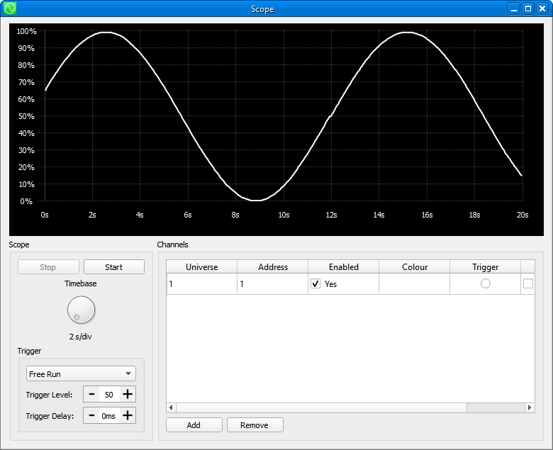
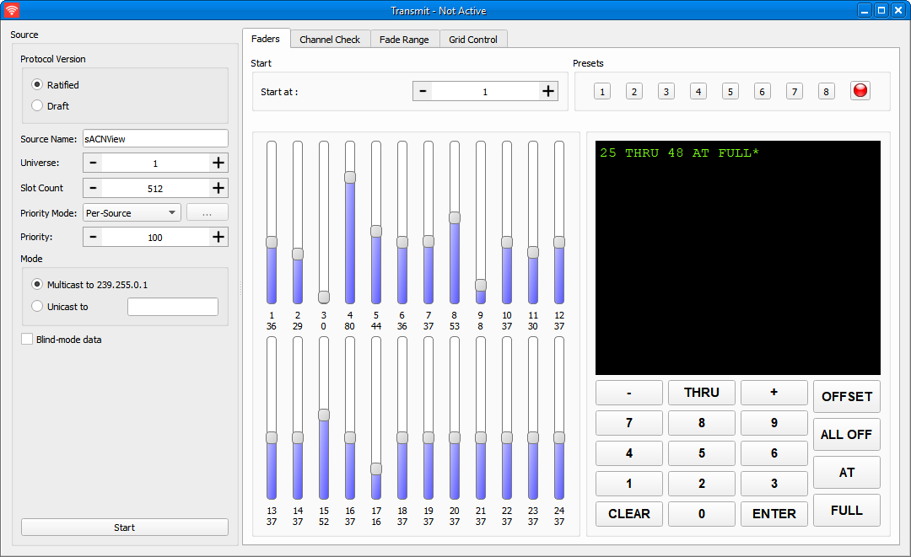
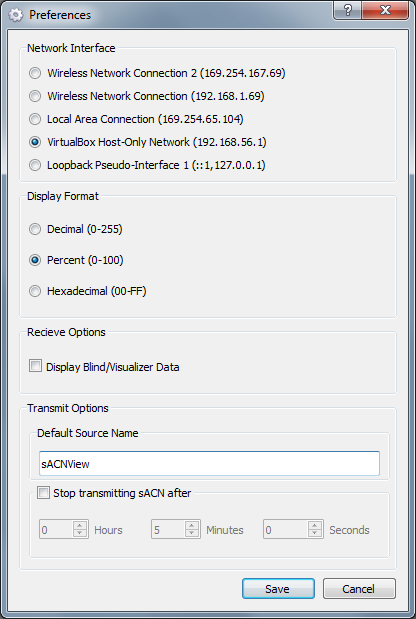

# Installing sACNView
To install sACNView on Windows, download and run the installer. Shortcuts will be created on the desktop and the start menu.

To install sACNView on Mac, download the .DMG file and open it. Drag the application into the Applications folder; it will now be available to run from finder.

If Windows alerts you that sACNView needs to make a network connection and that it is blocked by Windows Firewall, be sure to click 'Allow'

# Main Window
The main window contains multiple smaller windows for the different functions of the program.

## Main Window Buttons
The Scope view button opens an Oscilloscope View

The View button opens a single universe view

The Transmit button opens a transmitter for an sACN universe

The Snapshot button opens a window to snapshot and play back sACN universes

The Multi-Universe Transmit button opens a transmitter for multiple sACN universes

The Settings button opens the settings window

# Universe List

The Universe List shows a tree view list of twenty sACN Universes. Each can be expanded to show the names and IP addresses of active sources.

Double clicking on any universe will open up a universe view for that universe.

You can select the universe at which the view starts using the arrow buttons at the top, or by entering a universe number.

# Universe View

The Universe View shows a complete sACN universe, including all sources which are transmitting to that universe.

Sources are colour coded, and the colours correspond to the descriptions in the source table at the top.

For each source, the Name, CID, source priority, number of frames per second (FPS), Sequence Errors, and online/offline status are all displayed in the table.

In the main table section, the current levels of all channels in the universe are shown. Levels can be shown as absolute(0-255), percentage(0-100%) or hexadecimal (00-FF) as selected in the Settings dialog. The colour code allows you to identify which source has control of any given channel.

You can select a channel by clicking once on its level cell in the table. Once a channel is selected it will be shown in red, and you can see additional information on its level and the sources which control it. In the screenshot above, you can see that channel 7 is selected, and that there are two sources sending levels for it - the lighting console at level 123 and the Architectural System at level 226.

There are also tools to help troubleshoot intermittent problems. The flicker finder, when started, takes a 'snapshot' of the levels for the selected universe. All channels remain displayed in white until they change away from their snapshot value.

* Channels change to Green if their value has decreased from the snapshot value
* Channels change to Blue if their value has increased from the snapshot value
* Channels change to Red if their value has moved from the snapshot value and then returned to it

The pause button can be used at any time to temporarily halt the update of levels to allow inspection of data for individual channels

Sometimes it may be desirable to log every change of level, for example when troubleshooting an intermittent flicker. 'Start Log to File', and 'Open Log Window' allow you to do this by displaying every change of level on screen (log window) or saving every change of level to a file (log to file). Note that this can produce very large amounts of data if multiple channels are changing level at once).

You can switch the view to another universe by entering the universe number in the box at the top right and clicking 'Go'

# Scope View

The Scope View presents an oscilloscope view of channel level data against time. It may prove useful in diagnosing things that are timing critical, such as macros on moving light fixtures.

You can add channels to be displayed simultaneously in the scope view, which may be in any universes. The 'timebase', or speed, of the scope is controlled by the rotary knob to the left.

You may pause the scope at any time using the 'Stop' button.

You can also set the scope to trigger on a threshold for diagnosing intermittent events.

# Transmitting sACN

sACNView has the ability to transmit sACN levels in a variety of ways and patterns.

When you bring up the transmit window, the source will not begin transmitting until you click the 'Start' button. First, select a name for your source, a universe number, a priority, and whether you want to transmit live control levels or send blind/visualizer data. For more information about priority, refer to the Streaming ACN standards or the wiki pages.

Once you have started your source, you have several options to control the levels sent. The default is to use the faders shown to the right.

The faders can be slid up and down to set levels, and can be assigned to start at any address within the universe. Use the 'Fader Start Address' box to select which channel the faders start at.

A total of 8 presets can be recorded. The presets store all levels (fader positions) for the complete universe.

To record a preset, set the faders to the desired positions, then press the record button, then the button for the preset you wish to record

In addition to using the faders, you can use the other tabs at the top to perform other level set functions:

* Channel Check allows quick movement through channels in a universe, one at a time. You can type a number to jump directly to a channel; the blink button blinks the channel on and off.

* Fade Range provides a set of effects for working with channels or transmitting dynamic levels

# Transmitting Multiple Universes

You can transmit multiple universes at once using the multi-universe transmit window. Add sources to the table and select the effect or control you want.

# Program Settings

The preferences dialog allows you to set up options for sACNView. These are permanently stored on your computer.

If you have multiple network cards, you can select the card to be used in the 'Network Interface' selection. This network card will be used to send and recieve sACN data. If you change the network card, the application will restart.

You can choose how you prefer to have levels displayed. Choose either decimal (0-255), percentage(0-100%) or hexadecimal (00-FF)

You can select whether or not to display blind or visualiser data. Blind data is data output by a console intended for display on a simulation program but not for live use

You can specify a timeout after which sACN will not be displayed - i.e. once you start a source it will transmit for this amount of time and then stop.

You can specify a default source name. This is the name that will be used by default when you start transmitting sACN from the application.
